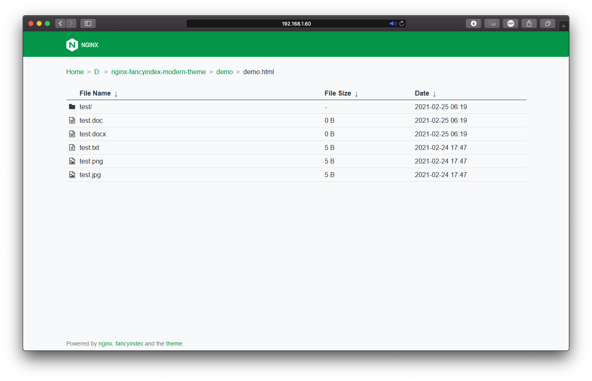

# Modern theme for nginx's fancyindex module
> This theme is heavily influenced by [nginx-fancyindex-flat-theme](https://github.com/alehaa/nginx-fancyindex-flat-theme) and uses modified files from this repository.

[](https://github.com/gonace/nginx-fancyindex-modern-theme/issues)



## About
> :grey_exclamation: You can see a preview/demo of what this theme looks like [here](https://test.obscured.dev)!

The [fancyindex module](https://github.com/aperezdc/ngx-fancyindex) of
[nginx](http://nginx.org/) has the powerful capability to be customizable.
Instead of using an external application, this gives us the ability to use just the webservers' capabilities to generate beautiful directory listings.

This theme provides a simple, flat interface based on
[Bootstrap 5](https://getbootstrap.com), [Font Awesome](https://fontawesome.com)
and (for easy navigation in galleries). In combination with
the browser's preview capability, accessing the majority of files should be
possible, giving the user easy access without a single line of server-side
dynamic code.

## Usage
1. Get the latest ressources from [GitHub releases](https://github.com/gonace/nginx-fancyindex-modern-theme/releases) and copy
   these files into any location accessible by *nginx* (`e.g. /usr/share/nginx/themes/modern`).
2. Configure your vhost to use the theme's ressources for fancyindex:
    ```
    # Fancyindex
    fancyindex             on;
    fancyindex_header      "/theme/header.html";
    fancyindex_footer      "/theme/footer.html";
    fancyindex_show_path   off;
    fancyindex_name_length 255;
    fancyindex_exact_size  off;
    fancyindex_localtime   on;
    fancyindex_time_format "%Y-%m-%d %H:%M:%S";

    location /theme {
        alias /usr/share/nginx/themes/modern;
    }
    ```
    > We recommend taking a look at [fancyindex_time_format](https://github.com/aperezdc/ngx-fancyindex#fancyindex_time_format) to customize the date-time formats.


## License
The nginx-fancyindex-modern-theme is free software: you can redistribute it and/or
modify it under the terms of the GNU General Public License as published by the
Free Software Foundation, either version 3 of the License, or (at your option)
any later version.

This software is distributed in the hope that it will be useful, but **WITHOUT
ANY WARRANTY**; without even the implied warranty of **MERCHANTABILITY** or
**FITNESS FOR A PARTICULAR PURPOSE**. A Copy of the GNU General Public License
can be found in the [LICENSE](LICENSE) file.
